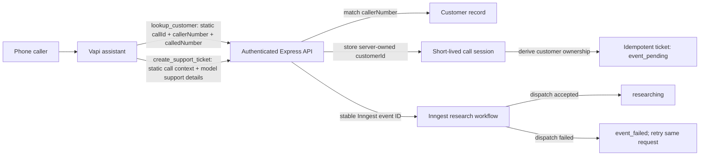

# Backend Contract Handoff: Trusted Vapi Caller to Inngest Workflow

Status: normative contract; implemented for the educational deployment

Date: July 22, 2026

## Read this first

This document replaces the earlier `BACKEND-HANDOFF.md` and
`BACKEND-REVIEW-HANDOFF.md` working notes. Those files were ignored by Git and
were never a shared source of truth.

There are no open architecture choices in this handoff:

- The repository owns the complete Vapi assistant configuration.
- Vapi uses the two API Request tools in `vapi/tools/`; the consolidated webhook
  is only a compatibility adapter.
- The language model never supplies customer identity.
- The backend derives customer ownership from trusted Vapi call context.
- Ticket creation is idempotent and workflow dispatch is durably visible.
- The caller hears the public `REP-xxxxxx` reference, never the internal ticket
  ID.

The assistant behavior established on commit `c9e10c1` remains the behavioral
baseline: model, voice, transcriber, concise speaking style, explicit ticket
confirmation, identifier readback, honest partial-failure handling, retry
permission, and simulations. The old contact-based identity mechanism from that
commit is intentionally replaced by the trusted-caller architecture described
here.

## Source-of-truth order

Use these files together:

1. `BACKEND-CONTRACT.md` — trust boundaries, ownership, exact backend contract,
   and remaining backend work.
2. `openapi.yaml` — machine-readable HTTP contract.
3. `vapi/assistant.config.json` and `vapi/assistant-system-prompt.md` — complete
   assistant configuration and behavior.
4. `vapi/tools/*.json` — the two deployable Vapi tool definitions.
5. `vapi/simulations/*` — deployable behavioral acceptance tests.
6. `scripts/deploy-vapi.mjs`, `scripts/check-vapi-config.mjs`, and
   `scripts/validate-vapi-assets.mjs` — deployment, drift detection, and local
   preflight validation.

Secrets, Vapi resource IDs, and the environment URL belong in `.env`; agent
behavior and tool schemas do not.

## Required architecture



The trust boundary is the key design decision:

- Trusted static Vapi fields: `callId`, `callerNumber`, `calledNumber`, and
  `requestId`.
- Model-controlled fields: `customerQuestion`, `deviceModel`,
  `firmwareVersion`, `symptom`, and `errorCode`.
- Backend-only fields: authoritative `customerId`, ticket ownership, state
  transitions, and correlation records.
- Untrusted caller claims: spoken name, email, phone number, customer ID,
  password, verification code, or any request to use another account.

The prompt, caller speech, and model-generated tool body must not authenticate a
caller or select a customer.

## Ownership

### Amanda / repository-owned Vapi configuration

- Assistant model, first message, voice, transcriber, and prompt.
- The `lookup_customer` and `create_support_ticket` API Request tools.
- Static Vapi parameters and the bearer Custom Credential.
- Vapi simulation scenarios, evaluations, and deployment scripts.
- The exact confirmation, success, partial-failure, and retry language.

The backend developer must not rewrite these assets to fit a different endpoint
design. If a backend limitation requires an agent change, document it and review
it with Amanda first.

### Backend / Inngest implementation

- Authentication and validation for every private route.
- Trusted caller lookup and short-lived call-session state.
- Server-derived customer ownership.
- Idempotent ticket persistence and retryable workflow dispatch.
- Correlated database, API, and Inngest identifiers and logs.
- Correct workflow state transitions, human review, and idempotent delivery.
- Database migrations and deployment persistence.

## Fixed Vapi transport

Vapi calls two endpoints directly:

| Tool | Endpoint | Trusted static fields | Model fields |
| --- | --- | --- | --- |
| `lookup_customer` | `POST /api/customers/lookup` | `callId`, `callerNumber`, `calledNumber` | none |
| `create_support_ticket` | `POST /api/tickets` | `requestId`, `callId`, `callerNumber`, `calledNumber` | support details only |

The static values are:

```text
requestId    = {{call.id}}
callId       = {{call.id}}
callerNumber = {{customer.number}}
calledNumber = {{phoneNumber.number}}
```

Do not replace these tools with a model-facing email/contact lookup. Do not add
`customerId`, email, phone, `callId`, or `requestId` to the model-facing body
schema. Do not make `/api/vapi/tools` the primary integration.

## Authentication

For this webinar repository, the fixed choice is bearer authentication:

```http
Authorization: Bearer <API_BEARER_TOKEN>
```

`npm run setup:auth` creates the corresponding Vapi Custom Credential. The
server must fail startup when the token is absent, except when explicit local
`DEMO_MODE=1` is enabled. Production must reject `DEMO_MODE=1`.

Bearer authentication is sufficient for this local educational demo; it is not
a claim of caller identity and is not the preferred production replay-defense
design. A production service should replace it with an agreed HMAC/timestamp or
equivalent signed request contract.

## Exact customer lookup contract

Request:

```http
POST /api/customers/lookup
Content-Type: application/json
Authorization: Bearer <API_BEARER_TOKEN>
```

```json
{
  "callId": "vapi-call-id",
  "callerNumber": "+15555550100",
  "calledNumber": "+15555550999"
}
```

Required behavior:

1. Authenticate and strictly validate the request.
2. Normalize both phone values to E.164 before lookup, storage, or comparison.
3. Match the customer using only trusted `callerNumber`.
4. Store the authoritative customer ID in a backend-owned session keyed by
   `callId`, with a 30-minute expiration.
5. Return only the minimum context the assistant needs.
6. Repeating the same call context is safe.
7. Reusing a `callId` with different trusted numbers returns
   `409 call_context_conflict` and is logged.
8. An unknown caller returns `404 caller_not_found`, creates no matched session,
   and discloses no account data.

Successful response:

```json
{
  "name": "Amanda Martin",
  "product": "Home Replicator",
  "deviceModel": "XR-200",
  "firmwareVersion": "9.4.0"
}
```

The name is conversation context, not proof that the human caller is Amanda.
The assistant must say matched caller, never verified or authenticated caller.

## Exact ticket contract

Request:

```http
POST /api/tickets
Content-Type: application/json
Authorization: Bearer <API_BEARER_TOKEN>
```

```json
{
  "requestId": "vapi-call-id",
  "callId": "vapi-call-id",
  "callerNumber": "+15555550100",
  "calledNumber": "+15555550999",
  "customerQuestion": "My replicator stopped working after the latest update.",
  "deviceModel": "XR-200",
  "firmwareVersion": "9.4.0",
  "symptom": "The thermal-safety light flashes.",
  "errorCode": "THERM-94"
}
```

Required behavior:

1. Authenticate and strictly validate the request.
2. Load the active session by `callId`.
3. Compare normalized caller and called numbers with the stored trusted context.
4. Derive `customerId` exclusively from the session.
5. Reject model- or client-supplied customer identity.
6. Use `requestId` as the stable idempotency key. In this design it equals the
   Vapi call ID, so one call creates at most one ticket.
7. Persist the ticket as `event_pending` before sending the Inngest event.
8. Use a deterministic Inngest event ID derived from `requestId`.
9. Transition to `researching` only after Inngest accepts the event.
10. On dispatch failure, persist `event_failed` and return the retryable response
    below.
11. An identical retry resumes dispatch for the existing ticket. It must not
    create another ticket or workflow run.
12. Reuse with different ticket content returns `409 idempotency_conflict`.

Complete success, including an idempotent duplicate:

```json
{
  "ok": true,
  "created": true,
  "ticketId": "ticket_internal_uuid",
  "ticketReference": "REP-004021",
  "ticketSaved": true,
  "workflowStarted": true,
  "status": "researching",
  "duplicate": false,
  "retryable": false
}
```

On an identical repeat, `created` becomes `false` and `duplicate` becomes `true`;
the IDs and reference remain unchanged.

Saved ticket but failed workflow dispatch:

```json
{
  "ok": false,
  "error": "workflow_dispatch_failed",
  "ticketId": "ticket_internal_uuid",
  "ticketReference": "REP-005003",
  "ticketSaved": true,
  "workflowStarted": false,
  "status": "event_failed",
  "retryable": true
}
```

The assistant may retry only after the caller agrees to: “Should I retry
starting the support workflow?” The retry sends the exact same request.

## Correlation and workflow contract

The `support/ticket.created` event must contain:

```json
{
  "name": "support/ticket.created",
  "data": {
    "ticketId": "ticket_internal_uuid",
    "callId": "vapi-call-id",
    "requestId": "vapi-call-id"
  }
}
```

The same `callId`, `requestId`, and `ticketId` must be present in the ticket row,
event data, relevant Inngest event metadata, downstream events, and workflow
results. The accepted Inngest event ID must be logged or persisted so a demo
operator can trace the action end to end.

Every API request and state transition must emit a structured log containing,
when applicable:

```text
timestamp, route, toolName, callId, requestId, ticketId,
outcome, httpStatus, durationMs, inngestEventId, errorCode
```

Internal logs may include `customerId`; public responses must not. Never log
authorization values, secrets, full transcripts, or unnecessary contact data.

## Do not implement

- Do not ask the caller for an email, phone number, or customer ID to establish
  account ownership.
- Do not return or accept a model-controlled `customerId`.
- Do not collapse the two direct API Request tools into a new primary webhook.
- Do not replace the prompt, model, voice, transcriber, or simulation behavior.
- Do not report complete success from only a `ticketId` or `ticketReference`.
- Do not mark a ticket `researching` before Inngest accepts its event.
- Do not retry a failed side effect without caller permission.
- Do not silently enable demo authentication bypass in a deployed environment.

## Current implementation status

Implemented and covered in the current branch:

- [x] Two direct, repository-defined Vapi API Request tools.
- [x] Static Vapi call context on both tools.
- [x] Bearer Custom Credential setup and fail-closed API authentication.
- [x] Short-lived matched call session with backend-owned customer ID.
- [x] No public/model-facing `customerId`.
- [x] Ticket context must match the active call session.
- [x] One ticket per call, duplicate detection, and content-conflict rejection.
- [x] `event_pending` → `researching` or `event_failed` dispatch states.
- [x] Retry resumes the saved ticket without creating a duplicate.
- [x] Stable public ticket references and full success/failure payloads.
- [x] Correlation IDs in database rows, Inngest event data/metadata, downstream
  events, and workflow results.
- [x] Known-issue, human-review, human-resolution, and idempotent-delivery paths.
- [x] Canonical assistant behavior, tool schemas, simulations, provisioning,
  drift checks, and local validation stored in the repository.
- [x] Transactional, idempotent migration from the exact `c9e10c1` schema and
  the temporary `replicator_model` schema to canonical `device_model`.
- [x] E.164 normalization before lookup, session storage, reuse comparison, and
  ticket-context comparison.
- [x] Deterministic `call_context_conflict` handling for changed caller or called
  numbers on a reused call ID.
- [x] Structured API and ticket-state logs with call, request, ticket, and
  accepted Inngest event IDs.
- [x] Expired-session cleanup that preserves active sessions.
- [x] Unit, contract, coverage, exact-schema migration, and disposable local
  integration tests.

## Production follow-up outside the educational deployment

### Public hosting decision

The repository defaults to SQLite. Before Railway or another multi-instance or
ephemeral deployment, either attach documented persistent storage with a
single-writer constraint or migrate to a suitable external database. A local
SQLite file is acceptable for the webinar on one process; ephemeral production
storage is not.

### Dependency audit

As of July 22, 2026, `npm audit --omit=dev` reports 28 production findings: 5
high and 23 moderate, primarily in the `@inngest/otel` OpenTelemetry tree.
The live test environment is explicitly educational and has no customers. Before
reusing this service for production data, upgrade to a supported non-vulnerable
combination and rerun:

```text
npm audit --omit=dev
```
